# 🏥 Medical Dataset Creator

**Generate high-quality medical conversation datasets from PDF documents using cutting-edge AI models**

[](https://www.python.org/downloads/)
[](LICENSE)
[](https://www.deepseek.com/)
[](https://openrouter.ai/)
[](https://huggingface.co/)

## 🏗️ System Architecture

```mermaid
graph TB
    A[📄 Input PDFs] --> B[🔍 PDF Processor]
    B --> C[📝 Text Extraction]
    C --> D[✂️ Smart Chunking]
    D --> E[🤖 AI Model Selection]
    
    E --> F[☁️ Cloud APIs]
    E --> G[🏠 Local Models]
    
    F --> H[🔮 DeepSeek]
    F --> I[🌐 OpenRouter]
    F --> J[🧠 OpenAI]
    
    G --> K[🤗 Hugging Face]
    
    H --> L[💬 Conversation Generation]
    I --> L
    J --> L
    K --> L
    
    L --> M[✅ Quality Validation]
    M --> N[📊 Dataset Output]
    M --> O[📈 Metadata]
    
    style A fill:#e1f5fe
    style N fill:#e8f5e8
    style O fill:#fff3e0
    style L fill:#f3e5f5
```



## 📊 Performance Comparison

```
┌─────────────────────────────────────────────────────────────────┐
│                    🚀 Provider Performance                      │
├─────────────┬──────────┬─────────┬──────────┬─────────┬─────────┤
│ Provider    │ Cost/1K  │ Quality │ Speed    │ Privacy │ Setup   │
├─────────────┼──────────┼─────────┼──────────┼─────────┼─────────┤
│ 🔮 DeepSeek │ $0.14    │ ⭐⭐⭐⭐⭐ │ ⚡⚡⚡⚡   │ ☁️      │ 🟢 Easy │
│ 🌐 OpenRtr  │ $0.50    │ ⭐⭐⭐⭐⭐ │ ⚡⚡⚡     │ ☁️      │ 🟢 Easy │
│ 🧠 OpenAI   │ $1.00    │ ⭐⭐⭐⭐⭐ │ ⚡⚡⚡     │ ☁️      │ 🟢 Easy │
│ 🏠 Local    │ Free     │ ⭐⭐⭐     │ ⚡⚡       │ 🔒 Full │ 🟡 Med  │
└─────────────┴──────────┴─────────┴──────────┴─────────┴─────────┘
```

## 🔄 Data Flow Pipeline

```mermaid
flowchart LR
    Start([📁 Start]) --> Check{🔧 Config Valid?}
    Check -->|❌ No| Error[❌ Show Error]
    Check -->|✅ Yes| Scan[📄 Scan PDFs]
    
    Scan --> Extract[🔍 Extract Text]
    Extract --> Chunk[✂️ Create Chunks]
    Chunk --> Quality{📊 Quality Check}
    
    Quality -->|❌ Poor| Skip[⏭️ Skip Chunk]
    Quality -->|✅ Good| Generate[🤖 Generate Conversations]
    
    Generate --> Validate{✅ Valid JSON?}
    Validate -->|❌ No| Retry[🔄 Retry]
    Validate -->|✅ Yes| Save[💾 Save to Dataset]
    
    Skip --> More{📄 More Chunks?}
    Retry --> More
    Save --> More
    
    More -->|✅ Yes| Chunk
    More -->|❌ No| Complete[🎉 Complete]
    
    Error --> End([🏁 End])
    Complete --> End
    
    style Start fill:#e1f5fe
    style Complete fill:#e8f5e8
    style Error fill:#ffebee
    style Generate fill:#f3e5f5
```



 ## 🚀 What's New in v2.2

- **🖥️ Interactive TUI Interface**: Beautiful terminal interface for easy configuration and monitoring
- **📋 Multiple Dataset Formats**: Support for ChatML and Instruction formats
- **⚡ Real-time Progress Tracking**: Live progress bars and generation logs
- **🔧 Configuration Validation**: Built-in API key and model availability checking
- **🎯 Smart Defaults**: Launch TUI by default when running `python main.py`

## 🖥️ Interactive TUI Interface

The new Terminal User Interface (TUI) makes dataset generation effortless:

```bash
# Launch interactive interface (recommended)
python main.py

# Or explicitly launch TUI
python main.py tui
```

**TUI Features:**
- 🤖 **Provider Selection**: Choose between DeepSeek, OpenAI, or Local models
- 📋 **Format Selection**: Pick ChatML or Instruction format
- ⚙️ **Generation Options**: Configure sample vs full generation, limits, directories
- 📊 **Real-time Monitoring**: Progress bars, logs, and statistics
- ✅ **Configuration Check**: Validate API keys and model availability

## 📋 Dataset Formats

### ChatML Format (Conversations Array)
```json
{
  "id": "1",
  "conversations": [
    {
      "from": "human",
      "value": "What are the symptoms of diabetes?"
    },
    {
      "from": "gpt",
      "value": "Common symptoms of diabetes include frequent urination, excessive thirst, unexplained weight loss..."
    }
  ]
}
```

### Instruction Format (Instruction Tuning)
```json
{
  "instruction": "You are a medical AI assistant. Provide helpful, accurate medical information...",
  "input": "What are the symptoms of diabetes?",
  "output": "Common symptoms of diabetes include frequent urination, excessive thirst, unexplained weight loss..."
}
```

---

## 📋 Table of Contents

- [🎯 Features](#-features)
- [🏃 Quick Start](#-quick-start)
- [⚙️ Configuration](#️-configuration)
- [🤖 AI Models](#-ai-models)
- [💻 Usage Examples](#-usage-examples)
- [📊 Output Format](#-output-format)
- [🔧 Advanced Usage](#-advanced-usage)
- [🐛 Troubleshooting](#-troubleshooting)
- [🤝 Contributing](#-contributing)
- [📄 License](#-license)

---

## 🎯 Features

### 🧠 **Multi-Provider AI Support**
- **DeepSeek API**: Cost-effective, high-quality medical conversations
- **OpenAI-Compatible APIs**: OpenRouter, OpenAI, Claude via OpenRouter, and more
- **Local Models**: Privacy-focused Hugging Face models for offline use
- **Automatic Fallback**: Graceful switching between providers when one fails

### 📚 **Advanced PDF Processing**
- **Multiple Extraction Methods**: PyPDF2, pdfplumber, PyMuPDF for maximum compatibility
- **Intelligent Text Chunking**: Smart chunking with configurable overlap
- **Quality Scoring**: Automated confidence scoring for extracted content
- **Batch Processing**: Handle multiple PDFs efficiently

### 🎛️ **Flexible Generation**
- **Configurable Conversation Style**: Adjust length, tone, and medical focus
- **Progress Tracking**: Real-time progress bars and detailed statistics
- **Medical Safety**: Built-in disclaimers and ethical guidelines
- **Quality Assurance**: Automated filtering and validation

### 📈 **Production-Ready Features**
- **Comprehensive Metadata**: Track sources, confidence scores, and generation details
- **Error Recovery**: Robust error handling and retry mechanisms
- **Memory Optimization**: 8-bit quantization for large models
- **Export Formats**: Multiple output formats for different use cases

---

## 🏃 Quick Start

### 📋 **Installation Flow**

```mermaid
flowchart TD
    A[📥 Clone Repository] --> B[🐍 Create Virtual Environment]
    B --> C[📦 Install Dependencies]
    C --> D[⚙️ Configure Environment]
    D --> E{🔑 Choose Provider}
    
    E -->|🔮 DeepSeek| F[💰 Get DeepSeek API Key]
    E -->|🌐 OpenRouter| G[🌍 Get OpenRouter Key]
    E -->|🏠 Local| H[🤗 Download Models]
    
    F --> I[✅ Test Configuration]
    G --> I
    H --> I
    
    I --> J{🧪 Test Passed?}
    J -->|❌ No| K[🔧 Fix Issues]
    J -->|✅ Yes| L[🚀 Generate First Dataset]
    
    K --> I
    L --> M[🎉 Success!]
    
    style A fill:#e1f5fe
    style M fill:#e8f5e8
    style K fill:#ffebee
    style E fill:#f3e5f5
```



### 🎯 **Feature Overview**

```
┌─────────────────────────────────────────────────────────────────────────────┐
│                           🏥 DS_Creator Features                           │
├─────────────────┬─────────────────┬─────────────────┬─────────────────────┤
│                 │                 │                 │                     │
│   📚 INPUT      │   🤖 AI MODELS  │   💬 OUTPUT     │   🔧 MANAGEMENT     │
│                 │                 │                 │                     │
│ 📄 PDF Files    │ ☁️  Cloud APIs   │ 📋 ChatML       │ 🖥️  Interactive TUI │
│ 📁 Batch Load   │ 🔮 DeepSeek     │ 📋 Instruction  │ 🔧 Config Validate │
│ 🔍 Auto Extract │ 🌐 OpenRouter   │ 📊 Metadata     │ 📈 Progress Track   │
│ ✂️  Smart Chunk │ 🧠 OpenAI       │ 📈 Statistics   │ 🔄 Error Recovery  │
│ 📊 Quality Check│ 🏠 Local Models │ 🎯 JSON Format  │ 📝 Detailed Logs   │
│                 │                 │                 │                     │
└─────────────────┴─────────────────┴─────────────────┴─────────────────────┘
```

### 1️⃣ **Installation**

```bash
# Clone the repository
git clone https://github.com/Ammar-Alnagar/DS_Creator.git
cd DS_Creator

# Create and activate virtual environment
python -m venv venv

# Linux/Mac
source venv/bin/activate

# Windows
venv\Scripts\activate

# Install dependencies
pip install -r requirements.txt
```

### 2️⃣ **Configuration**

Create a `.env` file from the sample:

```bash
# Copy sample configuration
cp env.sample .env

# Edit with your preferred editor
nano .env  # or vim, code, etc.
```

**Quick Setup Options:**

#### 🥇 **DeepSeek (Recommended - Best Cost/Quality)**
```env
API_PROVIDER=deepseek
DEEPSEEK_API_KEY=your_deepseek_api_key_here
DEFAULT_MODEL=deepseek-chat
```

#### 🌐 **OpenRouter (Most Model Options)**
```env
API_PROVIDER=openai
OPENAI_API_KEY=your_openrouter_api_key_here
OPENAI_BASE_URL=https://openrouter.ai/api/v1
DEFAULT_MODEL=anthropic/claude-3-sonnet
```

#### 🔒 **Local Models (Privacy-First)**
```env
API_PROVIDER=local
USE_LOCAL_MODEL=true
LOCAL_MODEL_NAME=microsoft/DialoGPT-medium
```

### 3️⃣ **Generate Your First Dataset**

```bash
# Quick test with sample dataset
python main.py generate --sample

# Check system configuration
python main.py config-check

# Generate full dataset
python main.py generate --max-conversations 1000

# Analyze PDFs before generation
python main.py analyze --input-dir ./input_pdfs
```

---

## ⚙️ Configuration

### 🔑 **API Provider Comparison**

| Provider | Cost/1K Tokens | Quality | Privacy | Setup | GPU Required |
|----------|----------------|---------|---------|-------|--------------|
| **DeepSeek** | $0.14-0.28 | ⭐⭐⭐⭐⭐ | Cloud | 🟢 Easy | ❌ No |
| **OpenRouter** | $0.50-3.00 | ⭐⭐⭐⭐⭐ | Cloud | 🟢 Easy | ❌ No |
| **OpenAI** | $1.00-10.00 | ⭐⭐⭐⭐⭐ | Cloud | 🟢 Easy | ❌ No |
| **Local Models** | Free | ⭐⭐⭐ | Private | 🟡 Medium | ⚠️ Recommended |

### 📋 **Complete Environment Variables**

```env
# === CORE CONFIGURATION ===
API_PROVIDER=deepseek                    # deepseek, openai, or local
DEFAULT_MODEL=deepseek-chat              # Model identifier
TEMPERATURE=0.7                          # Creativity level (0.0-1.0)
MAX_TOKENS=1000                          # Maximum response length

# === API CREDENTIALS ===
# DeepSeek (Recommended)
DEEPSEEK_API_KEY=your_deepseek_key_here

# OpenAI-Compatible APIs
OPENAI_API_KEY=your_openai_key_here
OPENAI_BASE_URL=https://openrouter.ai/api/v1  # Optional for custom endpoints
OPENAI_ORGANIZATION=your_org_id               # Optional

# === GENERATION SETTINGS ===
MAX_CONVERSATIONS_PER_CHUNK=5            # Conversations per text chunk
MIN_CONVERSATION_LENGTH=50               # Minimum words per message
MAX_CONVERSATION_LENGTH=500              # Maximum words per message

# === TEXT PROCESSING ===
CHUNK_SIZE=2000                          # Characters per text chunk
CHUNK_OVERLAP=200                        # Overlap between chunks
BATCH_SIZE=10                            # Processing batch size

# === LOCAL MODEL SETTINGS ===
USE_LOCAL_MODEL=false                    # Enable local models
LOCAL_MODEL_NAME=microsoft/DialoGPT-medium
DEVICE=auto                              # auto, cpu, cuda, mps
LOAD_IN_8BIT=true                        # Memory optimization
MAX_MEMORY_GB=8                          # GPU memory limit

# === DIRECTORIES ===
INPUT_DIR=./input_pdfs                   # PDF source directory
OUTPUT_DIR=./datasets                    # Output directory
MODELS_CACHE_DIR=./models_cache          # Model cache directory

# === LOGGING ===
LOG_LEVEL=INFO                          # DEBUG, INFO, WARNING, ERROR
```

### 🔧 **Configuration Tips**

- **Comments in Environment Variables**: The system automatically strips comments from config values
- **Auto Device Detection**: Set `DEVICE=auto` to automatically detect CUDA/MPS
- **Memory Management**: Enable `LOAD_IN_8BIT=true` for large models on limited hardware
- **Quality vs Speed**: Lower `TEMPERATURE` for more focused output, higher for creativity

### 🔑 **AI Models Ecosystem**

```
                    🌐 CLOUD MODELS                         🏠 LOCAL MODELS
    ┌─────────────────────────────────────────┐    ┌─────────────────────────────────┐
    │                                         │    │                                 │
    │  🔮 DeepSeek                           │    │  🤗 Hugging Face               │
    │  ├─ deepseek-chat      ($0.14/1K) ⭐⭐⭐⭐⭐│    │  ├─ DialoGPT-medium    (1.5GB) │
    │  └─ deepseek-coder     ($0.28/1K) ⭐⭐⭐⭐ │    │  ├─ DialoGPT-large     (3GB)   │
    │                                         │    │  └─ BlenderBot-400M    (1.6GB)  │
    │  🌐 OpenRouter                         │    │                                 │
    │  ├─ claude-3-sonnet    ($3.00/1K) ⭐⭐⭐⭐⭐│    │  🔒 Privacy Benefits:          │
    │  ├─ gpt-4o            ($5.00/1K) ⭐⭐⭐⭐⭐│    │  ✅ No data leaves your system │
    │  ├─ llama-3-70b       ($0.80/1K) ⭐⭐⭐⭐ │    │  ✅ Offline capability         │
    │  └─ gemini-pro-1.5    ($1.25/1K) ⭐⭐⭐⭐ │    │  ✅ No usage limits            │
    │                                         │    │  ⚠️  Requires GPU (recommended)  │
    │  🧠 Direct OpenAI                      │    │                                 │
    │  ├─ gpt-4o            ($10.0/1K) ⭐⭐⭐⭐⭐│    └─────────────────────────────────┘
    │  ├─ gpt-4-turbo       ($8.00/1K) ⭐⭐⭐⭐ │
    │  └─ gpt-3.5-turbo     ($2.00/1K) ⭐⭐⭐   │
    │                                         │
    └─────────────────────────────────────────┘
```

### 🏗️ **Deployment Architecture**


| Provider | Cost/1K Tokens | Quality | Privacy | Setup | GPU Required |
|----------|----------------|---------|---------|-------|--------------|
| **DeepSeek** | $0.14-0.28 | ⭐⭐⭐⭐⭐ | Cloud | 🟢 Easy | ❌ No |
| **OpenRouter** | $0.50-3.00 | ⭐⭐⭐⭐⭐ | Cloud | 🟢 Easy | ❌ No |
| **OpenAI** | $1.00-10.00 | ⭐⭐⭐⭐⭐ | Cloud | 🟢 Easy | ❌ No |
| **Local Models** | Free | ⭐⭐⭐ | Private | 🟡 Medium | ⚠️ Recommended |

---

## 🤖 AI Models

### ☁️ **Cloud Models**

#### **DeepSeek Models (Recommended)**
```env
DEFAULT_MODEL=deepseek-chat              # Best for medical conversations
DEFAULT_MODEL=deepseek-coder             # Technical/research content
```
- **Pros**: Excellent quality, very affordable, fast
- **Cons**: Requires API key, internet connection
- **Best For**: Production use, large datasets

#### **OpenRouter Models**
```env
DEFAULT_MODEL=anthropic/claude-3-sonnet  # Excellent reasoning
DEFAULT_MODEL=anthropic/claude-3-opus    # Highest quality
DEFAULT_MODEL=google/gemini-pro-1.5      # Long context (1M+ tokens)
DEFAULT_MODEL=openai/gpt-4o              # Latest OpenAI model
DEFAULT_MODEL=meta-llama/llama-3-70b     # Open source, good quality
DEFAULT_MODEL=mistral/mistral-large      # European alternative
```
- **Pros**: Many model options, cutting-edge models
- **Cons**: More expensive than DeepSeek
- **Best For**: Experimentation, specific model requirements

#### **Direct OpenAI**
```env
DEFAULT_MODEL=gpt-4o                     # Latest model
DEFAULT_MODEL=gpt-4-turbo               # Fast and capable
DEFAULT_MODEL=gpt-3.5-turbo             # Affordable option
```
- **Pros**: Direct access, reliable
- **Cons**: Most expensive option
- **Best For**: When you need guaranteed OpenAI access

### 🏠 **Local Models (Privacy-First)**

#### **Recommended Local Models**
```env
# Balanced Quality/Size
LOCAL_MODEL_NAME=microsoft/DialoGPT-medium     # ~1.5GB, good conversations

# Higher Quality (More Resources)
LOCAL_MODEL_NAME=microsoft/DialoGPT-large      # ~3GB, better quality
LOCAL_MODEL_NAME=facebook/blenderbot-400M-distill  # ~1.6GB, optimized

# Smaller Options
LOCAL_MODEL_NAME=microsoft/DialoGPT-small      # ~700MB, basic quality
```

#### **Local Model Requirements**
- **RAM**: 4GB+ (8GB+ recommended)
- **Storage**: 1-5GB per model
- **GPU**: Optional but recommended (CUDA/MPS)
- **Time**: Initial download may take 10-30 minutes

---

## 💻 Usage Examples

### 🎯 **Usage Patterns**

```mermaid
graph TB
    subgraph "👨‍💻 User Types"
        Beginner[🔰 Beginner]
        Advanced[🎖️ Advanced User]
        Researcher[🔬 Researcher]
        Enterprise[🏢 Enterprise]
    end
    
    subgraph "🖥️ Interface Options"
        TUI[🎨 Interactive TUI]
        CLI[⌨️ Command Line]
        Script[📜 Python Scripts]
        API[🔌 API Integration]
    end
    
    subgraph "📊 Use Cases"
        Quick[⚡ Quick Testing]
        Production[🏭 Production Scale]
        Research[🧪 Research Dataset]
        Custom[🎨 Custom Pipeline]
    end
    
    Beginner --> TUI
    Beginner --> Quick
    
    Advanced --> CLI
    Advanced --> Production
    
    Researcher --> Script
    Researcher --> Research
    
    Enterprise --> API
    Enterprise --> Custom
    
    TUI --> Quick
    CLI --> Production
    Script --> Research
    API --> Custom
    
    style Beginner fill:#e8f5e8
    style Advanced fill:#e3f2fd
    style Researcher fill:#fff3e0
    style Enterprise fill:#f3e5f5
```



### 📈 **Performance Metrics**

```
                          🚀 GENERATION PERFORMANCE
    
    Provider    │ Speed (conv/min) │ Quality Score │ Cost/1000 conv │ Reliability
    ────────────┼─────────────────┼───────────────┼─────────────────┼─────────────
    🔮 DeepSeek │ ████████ 45     │ ⭐⭐⭐⭐⭐ 4.8  │ $2.10           │ ████████ 99%
    🌐 OpenRtr  │ ███████  35     │ ⭐⭐⭐⭐⭐ 4.9  │ $7.50           │ ███████  95%
    🧠 OpenAI   │ ██████   30     │ ⭐⭐⭐⭐⭐ 4.9  │ $15.00          │ ████████ 98%
    🏠 Local    │ ████     20     │ ⭐⭐⭐   3.5   │ $0.00           │ ██████   85%
    
    📊 Recommended Configuration by Use Case:
    
    🔰 Learning/Testing  → 🔮 DeepSeek + Sample Mode
    🏭 Production Scale  → 🔮 DeepSeek + Batch Processing  
    🔒 Privacy Required  → 🏠 Local Models + GPU
    🎯 Maximum Quality   → 🧠 OpenAI GPT-4 + Low Temperature
```

### 🖥️ **Interactive TUI (Recommended)**

```bash
# Launch interactive interface (easiest method)
python main.py

# The TUI will guide you through:
# 1. Selecting AI provider (DeepSeek, OpenAI, Local)
# 2. Choosing dataset format (ChatML or Instruction)
# 3. Configuring generation options
# 4. Monitoring real-time progress
```

### 🎯 **Command Line Interface**

```bash
# Generate sample dataset (50 conversations)
python main.py generate --sample

# Generate from specific directory
python main.py generate --input-dir ./medical_books --max-conversations 500

# Custom output filename
python main.py generate --output-file cardiology_dataset.json

# Force local model usage
python main.py generate --use-local --max-conversations 100
```

### 🔍 **Analysis & Validation**

```bash
# Analyze PDFs without generating (fast preview)
python main.py analyze --input-dir ./medical_pdfs

# Validate existing dataset format
python main.py validate ./datasets/my_dataset.json

# Check configuration and test models
python main.py config-check

# List available local models
python main.py local-models --list-models

# Test specific local model
python main.py local-models microsoft/DialoGPT-medium
```

### ⚙️ **Advanced Generation**

```bash
# High-quality, focused generation
API_PROVIDER=deepseek \
TEMPERATURE=0.5 \
MAX_CONVERSATIONS_PER_CHUNK=3 \
python main.py generate --max-conversations 2000

# Privacy-focused local generation
USE_LOCAL_MODEL=true \
LOCAL_MODEL_NAME=microsoft/DialoGPT-large \
DEVICE=cuda \
python main.py generate --use-local --max-conversations 500

# Debug mode with detailed logging
LOG_LEVEL=DEBUG python main.py generate --sample

# Custom directories and limits
python main.py generate \
  --input-dir ./specialized_pdfs \
  --output-file specialized_dataset.json \
  --max-conversations 1500
```

### 🔄 **Multi-Provider Workflow**

```bash
# Test with different providers
export API_PROVIDER=deepseek && python main.py config-check
export API_PROVIDER=openai && python main.py config-check
export USE_LOCAL_MODEL=true && python main.py config-check

# Generate with different models for comparison
export DEFAULT_MODEL=deepseek-chat && python main.py generate --sample
export DEFAULT_MODEL=anthropic/claude-3-sonnet && python main.py generate --sample
```

---

## 📊 Output Format

### 🎨 **Dataset Format Visualization**

```mermaid
graph LR
    subgraph "📋 ChatML Format"
        A[👤 Human Message] --> B[🤖 Assistant Response]
        B --> C[👤 Follow-up] 
        C --> D[🤖 Response]
    end
    
    subgraph "📋 Instruction Format"
        E[📝 System Instruction] --> F[❓ User Input]
        F --> G[💬 Model Output]
    end
    
    subgraph "📊 Metadata"
        H[🏥 Medical Context]
        I[📄 Source PDF]
        J[⚡ Model Info]
        K[📈 Quality Score]
    end
    
    style A fill:#e3f2fd
    style B fill:#f3e5f5
    style C fill:#e3f2fd
    style D fill:#f3e5f5
    style E fill:#fff3e0
    style F fill:#e8f5e8
    style G fill:#f3e5f5
```



### 📈 **Processing Workflow**

```
                    🔄 DATASET GENERATION PIPELINE
    
    📄 PDF Input → 🔍 Text Extract → ✂️ Chunk → 🤖 AI Generate → ✅ Validate → 💾 Save
         │              │             │           │              │           │
         ▼              ▼             ▼           ▼              ▼           ▼
    📚 Multiple     📝 Clean Text   📦 Smart    💬 Medical      🧪 JSON     📊 Dataset
    Documents       Quality Check   Segments   Conversations   Validation   + Metadata
    
    Progress: [████████████████████████████████████████] 100%
    Stats:    📄 15 PDFs → 📦 342 Chunks → 💬 1,247 Conversations → ✅ 98.5% Success
```

### 📋 **Main Dataset File**

```json
[
  {
    "id": "1",
    "conversations": [
      {
        "from": "human",
        "value": "I've been experiencing chest pain during exercise. What could this indicate?"
      },
      {
        "from": "gpt",
        "value": "Chest pain during exercise can be a serious symptom that warrants immediate medical attention. This could potentially indicate several conditions including angina, coronary artery disease, or other cardiac issues. I strongly recommend consulting with a cardiologist as soon as possible for proper evaluation. They may perform tests such as an ECG, stress test, or echocardiogram to determine the underlying cause. Please don't delay seeking medical care, as chest pain during physical activity should always be evaluated by a healthcare professional."
      }
    ]
  },
  {
    "id": "2",
    "conversations": [
      {
        "from": "human",
        "value": "What are the common side effects of blood pressure medications?"
      },
      {
        "from": "gpt",
        "value": "Blood pressure medications can have various side effects depending on the specific type. Common ones include dizziness, fatigue, headaches, and sometimes a dry cough (particularly with ACE inhibitors). Beta-blockers may cause cold hands and feet, while diuretics can lead to increased urination and electrolyte imbalances. However, it's important to note that many people tolerate these medications well, and the benefits usually outweigh the risks. If you're experiencing concerning side effects, please consult your healthcare provider immediately rather than stopping the medication on your own, as they can adjust dosages or switch to alternative treatments."
      }
    ]
  },
  {
    "id": "3",
    "conversations": [
      {
        "from": "human",
        "value": "How can I manage diabetes through diet?"
      },
      {
        "from": "gpt",
        "value": "Managing diabetes through diet involves several key strategies: controlling carbohydrate intake, choosing complex carbs over simple sugars, eating regular meals to maintain stable blood sugar levels, and focusing on fiber-rich foods. A balanced plate should include lean proteins, non-starchy vegetables, and whole grains. It's essential to work with a registered dietitian and your healthcare team to create a personalized meal plan that fits your specific needs, medications, and lifestyle. Regular blood sugar monitoring will help you understand how different foods affect your glucose levels."
      }
    ]
  }
]
```

### 📊 **Metadata File (.metadata.json)**

```json
{
  "generation_stats": {
    "total_pdfs_processed": 15,
    "total_chunks_extracted": 342,
    "total_conversations_generated": 1247,
    "successful_generations": 1247,
    "failed_generations": 3,
    "average_confidence_score": 0.87,
    "processing_time_seconds": 1847.3,
    "models_used": ["openai:deepseek-chat"]
  },
  "configuration": {
    "api_provider": "deepseek",
    "chunk_size": 2000,
    "chunk_overlap": 200,
    "temperature": 0.7,
    "max_tokens": 1000,
    "max_conversations_per_chunk": 5
  },
  "conversation_metadata": [
    {
      "source_pdf": "cardiology_textbook.pdf",
      "page_number": 45,
      "chunk_index": 12,
      "extraction_method": "pdfplumber",
      "confidence_score": 0.92,
      "medical_context": "Cardiovascular disease and exercise-induced symptoms",
      "generation_metadata": {
        "model": "deepseek-chat",
        "provider": "deepseek",
        "conversation_index": 0,
        "usage": {
          "prompt_tokens": 1250,
          "completion_tokens": 350,
          "total_tokens": 1600
        }
      },
      "timestamp": "2024-01-15T10:30:45.123456",
      "user_message_length": 76,
      "assistant_message_length": 285
    }
  ],
  "format_info": {
    "description": "Each conversation pair is stored as a separate record with ID and conversations array",
    "format_type": "id_conversations_array",
    "total_conversation_pairs": 1247,
    "total_records": 1247,
    "structure": "Each record contains id (string) and conversations array with from/value objects"
  }
}
```

---

## 🔧 Advanced Usage

### 🎛️ **Custom Prompt Engineering**

Modify generation prompts in `src/ai_models.py`:

```python
def _get_generation_prompt(self, medical_text: str, num_conversations: int) -> str:
    return f"""You are a specialized medical AI assistant creating educational conversation examples.

Create {num_conversations} realistic medical conversations based on this reference:

MEDICAL REFERENCE:
{medical_text[:1500]}

SPECIALIZED REQUIREMENTS:
- Focus on: {your_medical_specialty}
- Target audience: {your_target_audience}  
- Include specific: {your_requirements}
- Emphasize: {your_emphasis_areas}

SAFETY GUIDELINES:
- Always include appropriate medical disclaimers
- Encourage consulting healthcare professionals
- Avoid specific medical advice or diagnoses
- Focus on educational information only

Format as valid JSON..."""
```

### 📈 **Batch Processing Scripts**

```python
import asyncio
from pathlib import Path
from src.dataset_generator import MedicalDatasetGenerator

async def batch_generate_by_specialty():
    """Generate datasets for different medical specialties."""
    
    generator = MedicalDatasetGenerator()
    
    specialties = {
        "cardiology": "./pdfs/cardiology",
        "neurology": "./pdfs/neurology", 
        "pediatrics": "./pdfs/pediatrics",
        "emergency": "./pdfs/emergency_medicine"
    }
    
    for specialty, directory in specialties.items():
        print(f"Processing {specialty}...")
        
        try:
            output_path = await generator.generate_dataset(
                input_dir=Path(directory),
                output_filename=f"{specialty}_conversations.json",
                max_conversations=1000
            )
            
            stats = generator.get_statistics()
            print(f"✅ {specialty}: {stats.total_conversations_generated} conversations")
            print(f"   Quality: {stats.average_confidence_score:.2f}")
            print(f"   Time: {stats.processing_time_seconds:.1f}s\n")
            
        except Exception as e:
            print(f"❌ {specialty} failed: {e}\n")

# Run: python -c "import asyncio; from your_script import batch_generate_by_specialty; asyncio.run(batch_generate_by_specialty())"
```

### 🔄 **Dynamic Model Switching**

```python
from src.ai_models import AIModelManager
from config import config

async def multi_model_generation(text, conversations_per_model=5):
    """Generate conversations using multiple models for comparison."""
    
    models = [
        ("deepseek", "deepseek-chat"),
        ("openai", "anthropic/claude-3-sonnet"),
        ("openai", "gpt-4")
    ]
    
    all_conversations = []
    
    for provider, model_name in models:
        print(f"Generating with {provider}:{model_name}")
        
        # Temporarily switch configuration
        original_provider = config.api_provider
        original_model = config.default_model
        
        config.api_provider = provider
        config.default_model = model_name
        
        try:
            manager = AIModelManager()
            conversations = await manager.generate_conversations(text, conversations_per_model)
            all_conversations.extend(conversations)
        except Exception as e:
            print(f"Model {provider}:{model_name} failed: {e}")
        finally:
            # Restore original configuration
            config.api_provider = original_provider
            config.default_model = original_model
    
    return all_conversations
```

### 🔍 **Quality Analysis Tools**

```python
import json
from collections import Counter
from pathlib import Path

def analyze_dataset_quality(dataset_path: Path):
    """Analyze the quality and characteristics of a generated dataset."""
    
    with open(dataset_path) as f:
        data = json.load(f)
    
    conversations = data["conversations"]
    
    # Basic statistics
    total_convs = len(conversations)
    user_lengths = [len(conv[0]["value"].split()) for conv in conversations]
    assistant_lengths = [len(conv[1]["value"].split()) for conv in conversations]
    
    # Load metadata if available
    metadata_path = dataset_path.with_suffix('.metadata.json')
    metadata = {}
    if metadata_path.exists():
        with open(metadata_path) as f:
            metadata = json.load(f)
    
    print(f"📊 Dataset Quality Analysis: {dataset_path.name}")
    print(f"{'='*50}")
    print(f"Total conversations: {total_convs}")
    print(f"Average user message length: {sum(user_lengths)/len(user_lengths):.1f} words")
    print(f"Average assistant message length: {sum(assistant_lengths)/len(assistant_lengths):.1f} words")
    
    if "generation_stats" in metadata:
        stats = metadata["generation_stats"]
        print(f"Success rate: {(stats['successful_generations']/(stats['successful_generations']+stats['failed_generations'])*100):.1f}%")
        print(f"Average confidence: {stats['average_confidence_score']:.2f}")
    
    # Medical term analysis
    medical_terms = ["symptom", "diagnosis", "treatment", "medication", "doctor", "patient", "medical", "health"]
    term_counts = Counter()
    
    for conv in conversations:
        text = (conv[0]["value"] + " " + conv[1]["value"]).lower()
        for term in medical_terms:
            term_counts[term] += text.count(term)
    
    print(f"\n🏥 Medical Term Frequency:")
    for term, count in term_counts.most_common():
        print(f"  {term}: {count}")

# Usage: analyze_dataset_quality(Path("./datasets/my_dataset.json"))
```

---

## 🐛 Troubleshooting

### 🔧 **Quick Diagnosis Flowchart**

```mermaid
flowchart TD
    Start([🚨 Issue Detected]) --> Type{🔍 What's the Problem?}
    
    Type -->|❌ Won't Start| Config[⚙️ Configuration Issue]
    Type -->|🐌 Slow/Stuck| Performance[⚡ Performance Issue]
    Type -->|📊 Poor Quality| Quality[🎯 Quality Issue]
    Type -->|💥 Crashes| Error[🔥 Runtime Error]
    
    Config --> ConfigCheck[🧪 Run: python main.py config-check]
    ConfigCheck --> ConfigOK{✅ Config Valid?}
    ConfigOK -->|❌ No| FixConfig[🔧 Fix .env file]
    ConfigOK -->|✅ Yes| APITest[🌐 Test API Keys]
    
    Performance --> MemCheck[🧠 Check Memory Usage]
    MemCheck --> MemOK{💾 RAM Available?}
    MemOK -->|❌ No| ReduceLoad[⬇️ Reduce Batch Size]
    MemOK -->|✅ Yes| ModelCheck[🤖 Check Model Size]
    
    Quality --> TempCheck[🌡️ Check Temperature]
    TempCheck --> TempOK{🎯 < 0.8?}
    TempOK -->|❌ No| LowerTemp[⬇️ Lower Temperature]
    TempOK -->|✅ Yes| ModelUpgrade[⬆️ Try Better Model]
    
    Error --> LogCheck[📝 Check Logs]
    LogCheck --> LogClear{🔍 Error Clear?}
    LogClear -->|❌ No| Debug[🐛 Enable DEBUG mode]
    LogClear -->|✅ Yes| SpecificFix[🎯 Apply Specific Fix]
    
    FixConfig --> Retest[🔄 Test Again]
    ReduceLoad --> Retest
    LowerTemp --> Retest
    ModelUpgrade --> Retest
    Debug --> Support[💬 Contact Support]
    SpecificFix --> Retest
    APITest --> Retest
    ModelCheck --> Retest
    
    Retest --> Success{✅ Fixed?}
    Success -->|✅ Yes| Complete[🎉 Problem Solved!]
    Success -->|❌ No| Support
    
    style Start fill:#ffebee
    style Complete fill:#e8f5e8
    style Support fill:#fff3e0
    style Config fill:#e3f2fd
    style Performance fill:#f3e5f5
    style Quality fill:#fff3e0
    style Error fill:#ffebee
```



### 🚨 **Common Error Patterns**

```
    ERROR TYPE                 SYMPTOMS                    QUICK FIX
┌─────────────────────┬─────────────────────────┬─────────────────────────┐
│ 🔑 API Key Issues   │ • "Invalid API key"     │ python main.py         │
│                     │ • "Unauthorized"        │ config-check           │
│                     │ • "Rate limit"          │                        │
├─────────────────────┼─────────────────────────┼─────────────────────────┤
│ 🧠 Memory Problems  │ • "CUDA out of memory"  │ export LOAD_IN_8BIT=true│
│                     │ • System freezing       │ export BATCH_SIZE=3     │
│                     │ • Very slow generation  │                        │
├─────────────────────┼─────────────────────────┼─────────────────────────┤
│ 📄 PDF Issues      │ • "No text extracted"   │ python main.py analyze │
│                     │ • Empty chunks          │ --input-dir ./pdfs     │
│                     │ • Gibberish text        │                        │
├─────────────────────┼─────────────────────────┼─────────────────────────┤
│ 🌐 Network Issues   │ • Timeout errors        │ Check internet         │
│                     │ • Connection failed     │ Try different provider │
│                     │ • SSL errors            │                        │
├─────────────────────┼─────────────────────────┼─────────────────────────┤
│ 📊 Quality Issues   │ • Short responses       │ Lower TEMPERATURE      │
│                     │ • Irrelevant content    │ Use better model       │
│                     │ • Invalid JSON          │ Check prompt template  │
└─────────────────────┴─────────────────────────┴─────────────────────────┘
```

### ❌ **Common Issues and Solutions**

#### **1. AsyncIO Event Loop Errors (FIXED in v2.1)**
```bash
# If you see "asyncio.run() cannot be called from a running event loop"
# This was fixed in v2.1 - update your code:
git pull origin main
pip install -r requirements.txt
```

#### **2. Configuration Issues**
```bash
# Environment variables with comments not working
# ✅ Fixed: Comments are now automatically stripped

# Check current configuration
python main.py config-check

# Reset environment (if needed)
unset API_PROVIDER DEFAULT_MODEL
python main.py config-check
```

#### **3. API Key Problems**
```bash
# Verify API keys are properly set
echo "DeepSeek: $DEEPSEEK_API_KEY"
echo "OpenAI: $OPENAI_API_KEY"

# Test API connectivity
python main.py config-check

# Debug API calls
LOG_LEVEL=DEBUG python main.py generate --sample
```

#### **4. Model Loading Issues**
```bash
# Test local model availability
python main.py local-models --list-models

# Download specific model
python main.py local-models microsoft/DialoGPT-medium

# Check available models
python -c "from transformers import AutoTokenizer; print(AutoTokenizer.from_pretrained('microsoft/DialoGPT-medium'))"
```

#### **5. Memory Issues**
```bash
# Reduce memory usage
export LOAD_IN_8BIT=true
export MAX_MEMORY_GB=4
export BATCH_SIZE=3

# Use smaller model
export LOCAL_MODEL_NAME=microsoft/DialoGPT-small

# Monitor memory usage
python -c "import psutil; print(f'RAM: {psutil.virtual_memory().percent}%')"
```

#### **6. Quality Issues**
```bash
# Improve output quality
export TEMPERATURE=0.5                    # More focused
export MAX_CONVERSATIONS_PER_CHUNK=3     # More attention per conversation
export MIN_CONVERSATION_LENGTH=100       # Longer conversations

# Use higher-quality models
export DEFAULT_MODEL=anthropic/claude-3-opus  # (via OpenRouter)
export DEFAULT_MODEL=gpt-4                    # (via OpenAI)
```

#### **7. PDF Processing Issues**
```bash
# Test PDF extraction
python main.py analyze --input-dir ./problematic_pdfs

# Check PDF content
python -c "import PyPDF2; print(PyPDF2.__version__)"

# Try different extraction methods (modify in src/pdf_processor.py)
# Available: pypdf2, pdfplumber, pymupdf
```

### 🔍 **Debug Mode**

```bash
# Enable comprehensive debugging
export LOG_LEVEL=DEBUG
python main.py generate --sample

# Test individual components
python main.py analyze --input-dir ./test_pdfs
python main.py config-check
python main.py local-models --list-models
```

### 📞 **Getting Help**

1. **📚 Check Documentation**: Review this README thoroughly
2. **🐛 Search Issues**: [GitHub Issues](https://github.com/Ammar-Alnagar/DS_Creator/issues)
3. **📊 Run Diagnostics**: `python main.py config-check`
4. **🧪 Test Small**: Use `--sample` flag for testing
5. **📝 Enable Debug**: Use `LOG_LEVEL=DEBUG` for detailed logs
6. **💬 Ask for Help**: Open a new issue with:
   - Full error message
   - Your configuration (anonymized)
   - Steps to reproduce
   - System information (`python --version`, OS)

### 🚨 **Emergency Reset**

```bash
# Complete environment reset
unset $(env | grep -E "(DEEPSEEK|OPENAI|API_PROVIDER|DEFAULT_MODEL)" | cut -d= -f1)

# Reload configuration
source venv/bin/activate
cp env.sample .env
nano .env

# Test basic functionality
python main.py config-check
python main.py generate --sample
```

---

## 🤝 Contributing

We welcome contributions! Here's how to get involved:

### 🛠️ **Development Setup**

```bash
# Clone and setup development environment
git clone https://github.com/Ammar-Alnagar/DS_Creator.git
cd DS_Creator
python -m venv venv
source venv/bin/activate

# Install all dependencies including development tools
pip install -r requirements.txt

# Install pre-commit hooks (optional but recommended)
pip install pre-commit
pre-commit install
```

### 🧪 **Testing**

```bash
# Run test suite
pytest

# Run with coverage
pytest --cov=src --cov-report=html

# Test specific components
pytest tests/test_pdf_processor.py
pytest tests/test_ai_models.py

# Integration tests
python main.py generate --sample
python main.py config-check
```

### 📝 **Code Quality**

```bash
# Format code
black src/ main.py
isort src/ main.py

# Lint code
flake8 src/ main.py

# Type checking (if using mypy)
mypy src/

# All-in-one quality check
black src/ && isort src/ && flake8 src/ && pytest
```

### 🚀 **Contribution Guidelines**

1. **🍴 Fork the Repository**
   ```bash
   # Fork on GitHub, then clone your fork
   git clone https://github.com/YOUR_USERNAME/DS_Creator.git
   ```

2. **🌿 Create Feature Branch**
   ```bash
   git checkout -b feature/amazing-new-feature
   ```

3. **💻 Make Your Changes**
   - Follow existing code style
   - Add tests for new functionality
   - Update documentation as needed

4. **✅ Test Thoroughly**
   ```bash
   # Test your changes
   pytest
   python main.py generate --sample
   
   # Test different configurations
   API_PROVIDER=deepseek python main.py config-check
   USE_LOCAL_MODEL=true python main.py config-check
   ```